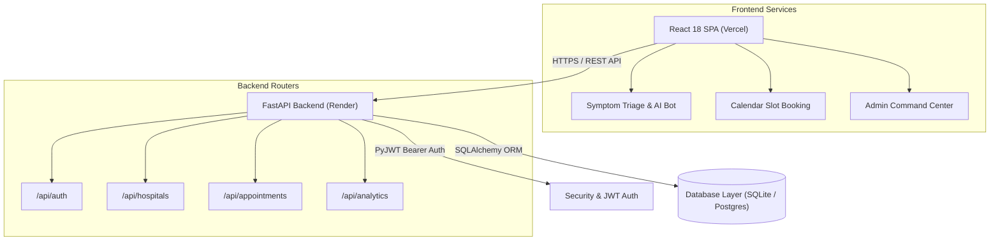

# Saathi — AI-Powered Healthcare Intelligence & Multi-Persona SaaS Platform

[](https://opensource.org/licenses/MIT)
[](https://www.python.org/)
[](https://fastapi.tiangolo.com/)
[](https://react.dev/)
[](https://www.typescriptlang.org/)

---

## 🔗 Live Demo

Access the live production deployment and interactive backend documentation:

* 🌐 **Live Web Application (Vercel)**: [https://saathi-taupe-iota.vercel.app](https://saathi-taupe-iota.vercel.app)
* ⚙️ **Backend REST API (Render)**: [https://saathi-ntbk.onrender.com/api](https://saathi-ntbk.onrender.com/api)
* 📑 **Interactive API Docs (Swagger UI)**: [https://saathi-ntbk.onrender.com/docs](https://saathi-ntbk.onrender.com/docs)

---

## 📖 Overview

**Saathi** is an all-in-one healthcare web platform built to solve three common problems in modern medicine: patient care navigation, physician schedule management, and hospital operations. Most healthcare software focuses on only one group of users. Saathi connects patients, doctors, and hospital administrators inside a single unified system, allowing medical data to flow securely between all three workflows.

For **patients**, Saathi removes guesswork from seeking medical care. It features an AI-driven symptom scanner that evaluates symptom urgency, detects emergency red flags, and matches patients to the right medical departments. Patients can explore hospital branches across major cities, view doctor ratings and experience, book 20-minute appointment slots, and estimate their out-of-pocket surgery costs based on their insurance coverage.

For **doctors** and **hospital managers**, Saathi provides real-time operational tools. Physicians get a clear daily schedule console complete with automated patient no-show risk indicators, direct prescription writing tools, and peer performance benchmarks. Hospital executives get live visual analytics tracking department bed occupancy, staffing alerts, and insurance claims clearance metrics.

---

## ✨ Key Features

* 🩺 **AI Symptom Triage Scan**: Guided 4-step questionnaire evaluating symptom severity, emergency warnings, and department matching confidence.
* 💬 **Empathetic AI Triage Advisor**: Conversational AI assistant supporting emotional wellness inquiries (*"feeling stressed"*, *"anxious about surgery"*) alongside database provider searches.
* 🏥 **Multi-City Hospital Directory**: Search across 9 hospital branches in Mumbai, Delhi, and Bangalore filtered by distance, rating, consultation fee, and insurance support.
* 📅 **Real-Time Calendar Slot Booking**: 20-minute appointment booking engine with atomic database locking and digital receipt generation.
* 💳 **Insurance & Surgery Cost Planner**: Out-of-pocket cost calculator for major procedures (Knee Replacement, Cataract, Bypass) factoring in deductibles, co-pays, and room-rent caps.
* 👨‍⚕️ **Physician Schedule & Prescription Console**: 12-column schedule board with patient risk badging, patient medical history toggles, and digital prescription creation.
* 📊 **Hospital Command Center Analytics**: Executive dashboard monitoring department load forecasts, staffing recommendations, and insurance claim approvals (Approved / Pending / Rejected).

---

## 🖥️ The Three Dashboards

Saathi includes three dedicated dashboards, each tailored for a specific user persona:

```
                                 ┌──────────────────────────────────────────────┐
                                 │              SAATHI PLATFORM                 │
                                 └──────┬───────────────┼───────────────┬───────┘
                                        │               │               │
                        ┌───────────────┴───┐   ┌───────┴───────────┐   ┌───┴───────────────┐
                        │ Patient App       │   │ Doctor Console    │   │ Hospital Command  │
                        │ Persona: Patient  │   │ Persona: Physician│   │ Persona: Admin BI │
                        └───────────────────┘   └───────────────────┘   └───────────────────┘
```

### 1. Patient App (`PatientApp.tsx`)
* **Who it's for**: Patients seeking medical advice, specialist consultations, or surgery planning.
* **What it's used for & significance**: Empowers patients with transparent healthcare navigation, transparent surgery costs, and direct scheduling without phone calls or paper forms.
* **Main Actions**: Run symptom triage, chat with the AI assistant, browse hospital branches, book appointment slots, view health timeline records, and calculate procedure insurance coverage.
* **Key Screens & Features**:
  - *Symptom Triage Scanner*: Step-by-step clinical questionnaire with emergency alert overlays.
  - *Conversational AI Assistant*: Empathetic chatbot querying live hospital and doctor databases.
  - *Hospital Branch & Specialist Finder*: Multi-city search with distance, fee, and rating sorting.
  - *Slot Booking & Receipt Generator*: Interactive 20-minute calendar picker with itemized cost summary.
  - *Insurance & Surgery Out-of-Pocket Planner*: Financial breakdown for surgeries based on Indian health plans.
  - *Clinical Health Timeline*: Chronological log of past consults, diagnoses, and doctor advice.

### 2. Doctor Console (`DoctorDashboard.tsx`)
* **Who it's for**: Physicians, specialists, and clinical staff.
* **What it's used for & significance**: Streamlines daily consultation schedules, reduces patient no-shows with predictive risk scoring, and simplifies prescription documentation.
* **Main Actions**: Review daily and weekly appointment lists, check patient risk scores, allocate availability blocks, inspect past medical history, and issue digital prescriptions.
* **Key Screens & Features**:
  - *12-Column Weekly Schedule Board*: Visual timeline showing upcoming appointments across branches.
  - *Predictive No-Show Risk Badging*: Automatic risk tags (*Moderate / High No-Show Risk*) per appointment.
  - *Prescription & Diagnosis Writer*: In-line form to submit diagnoses, treatment plans, and follow-up dates.
  - *Patient Medical History Drawer*: Quick expandable panel showing a patient's past consultation notes.
  - *Peer Benchmarks Card*: Metrics comparing average consult length (14 min vs 17 min peer avg), no-show rate (6%), and follow-up compliance (71%).
  - *Availability Block Allocator*: Tool to split working hours into 20-minute patient slots.

### 3. Hospital Command Center (`HospitalCommand.tsx`)
* **Who it's for**: Hospital operations managers, department heads, and insurance claims administrators.
* **What it's used for & significance**: Gives executive leadership real-time visibility into department capacity, staffing bottlenecks, and financial claims clearance.
* **Main Actions**: Monitor department occupancy load percentages, act on automated staffing recommendations, and inspect claims status across insurance providers.
* **Key Screens & Features**:
  - *Department Capacity Load Gauges*: Interactive meters tracking load in Cardiology, Orthopaedics, General Medicine, and Emergency.
  - *Staffing Recommendation Triggers*: Real-time operational alerts (*"Add 2 staff in Orthopaedics tomorrow 10 AM - 1 PM"*).
  - *Insurance Claims Clearance Visualizer*: Financial breakdown tracking approved, pending, and rejected claims across insurers (Niva Bupa, Star Health, ICICI Lombard, CGHS).

---

## 🛠️ Tech Stack

| Layer | Technology | Purpose |
| :--- | :--- | :--- |
| **Frontend Framework** | React 18 (TypeScript) | Fast, type-safe user interface component rendering |
| **Build Tool & Bundler** | Vite 8 | Ultra-fast local dev server and optimized production build bundling |
| **Styling & Icons** | Tailwind CSS, Lucide Icons | Clean slate-white aesthetic (`#F8FAFC`), custom cards, micro-animations |
| **Data Visualization** | Recharts | Interactive charts for vitals history, workload gauges, and claims analytics |
| **Backend Framework** | Python 3.11, FastAPI | High-performance asynchronous REST API with automatic OpenAPI Swagger docs |
| **Server Engine** | Uvicorn | Asynchronous Server Gateway Interface (ASGI) running Python workers |
| **Database & ORM** | SQLAlchemy 2.0, SQLite / PostgreSQL | Database object mapping, JSON array validators, cross-database support |
| **Authentication** | PyJWT, Passlib (Bcrypt) | Secure JSON Web Token auth flow and password hashing |
| **Deployment** | Vercel (Frontend) & Render (Backend) | Global edge CDN for React SPA and persistent Python container for API |

---

## 📐 Architecture

Saathi follows a decoupled client-server architecture:



1. **Client Layer**: A single-page application built with React 18 and TypeScript, hosted on Vercel's global CDN. All API requests are routed dynamically via `import.meta.env.VITE_API_BASE`.
2. **API Layer**: A FastAPI application hosted on a Render Python Web Service. It exposes RESTful JSON endpoints, enforces role-based access control, and automatically generates interactive Swagger documentation.
3. **Database Layer**: SQLAlchemy ORM connected to SQLite (`saarthi.db`) by default. On startup, the backend automatically creates missing tables and populates default demo data. Setting a `DATABASE_URL` environment variable seamlessly switches the backend to PostgreSQL (e.g., Neon or Supabase).

---

## 🚀 Getting Started (Local Setup)

Follow these explicit step-by-step instructions to run Saathi on your local computer.

### 1. Prerequisites
Ensure you have the following installed on your machine:
* **Python**: `v3.10` or higher ([Download Python](https://www.python.org/downloads/))
* **Node.js**: `v18.0` or higher ([Download Node.js](https://nodejs.org/))
* **Git**: ([Download Git](https://git-scm.com/))

---

### 2. Clone the Repository
Open your terminal or command prompt and run:
```bash
git clone https://github.com/BHAVYA15-lab/SAATHI.git
cd SAATHI
```

---

### 3. Backend Setup

#### Step 3.1: Navigate to the backend directory
```bash
cd backend
```

#### Step 3.2: Create and activate a Python Virtual Environment
* **Windows (PowerShell)**:
  ```powershell
  python -m venv venv
  .\venv\Scripts\activate
  ```
* **macOS / Linux**:
  ```bash
  python3 -m venv venv
  source venv/bin/activate
  ```

#### Step 3.3: Install Python Dependencies
```bash
pip install -r requirements.txt
```

#### Step 3.4: Configure Environment Variables
Create a local `.env` file inside the `backend/` folder:
```bash
# On Windows PowerShell:
Copy-Item .env.example .env

# On macOS/Linux:
cp .env.example .env
```

Open `backend/.env` in your code editor. It will contain:
```ini
SECRET_KEY=replace_this_with_a_generated_random_string
DATABASE_URL=sqlite:///./saarthi.db
CORS_ORIGINS=http://localhost:5173,http://127.0.0.1:5173
```

> ⚠️ **Important**: Generate a fresh secret key for your local setup by running this command in your terminal:
> ```bash
> python -c "import secrets; print(secrets.token_hex(32))"
> ```
> Copy the 64-character output string and paste it into your `backend/.env` file as the `SECRET_KEY` value.

#### Step 3.5: Seed the Database
Run the seeder script to populate your local SQLite database with 9 hospital branches, departments, doctors, and demo users:
```bash
python -m app.seed
```
*Output message: `Database seeding completed successfully!`*

#### Step 3.6: Start the Backend Server
```bash
uvicorn app.main:app --reload --port 8000
```
*The backend API will start running at:* `http://127.0.0.1:8000`  
*Interactive Swagger API documentation is available at:* `http://127.0.0.1:8000/docs`

---

### 4. Frontend Setup

Open a **new terminal window** and navigate to the project root directory:

#### Step 4.1: Navigate to the frontend directory
```bash
cd frontend
```

#### Step 4.2: Install Node Dependencies
```bash
npm install
```

#### Step 4.3: Configure Environment Variables
Create a local `.env` file inside the `frontend/` folder:
```bash
# On Windows PowerShell:
Copy-Item .env.example .env

# On macOS/Linux:
cp .env.example .env
```

Your `frontend/.env` will contain:
```ini
VITE_API_BASE=http://127.0.0.1:8000/api
```

#### Step 4.4: Start the Frontend Development Server
```bash
npm run dev
```
*The React application will start running at:* `http://localhost:5173`

---

### 🔑 Local Access & Pre-Seeded Demo Accounts

Open `http://localhost:5173` in your browser. Use the header role switcher or log in with any of these pre-configured accounts:

| Portal | Login Email | Password | Persona Role | Key Features to Test |
| :--- | :--- | :--- | :--- | :--- |
| **Patient App** | `aditi@email.com` | `password` | Patient | AI Symptom Check, Bot Chat, Slot Booking, Surgery Cost Planner |
| **Doctor Console** | `dr.vaidya@apexcare.in` | `password` | Physician | Daily Schedule Board, No-Show Risk Badges, Complete + Rx Writer |
| **Hospital Admin BI** | `ops@horizonhospital.in` | `password` | Admin / BI | Department Capacity Load Gauges, Insurance Claims Clearance Bar Chart |

---

## 🌐 Deployment Note

* **Production Backend**: Deployed on **Render** as a Python Web Service. Render builds the Python environment, runs database startup migrations, and executes Uvicorn. For configuration details, see [Render Documentation](https://render.com/docs).
* **Production Frontend**: Deployed on **Vercel** as a static Vite React SPA with client-side SPA route rewrites configured in `frontend/vercel.json`. For details, see [Vercel Documentation](https://vercel.com/docs).

---

## 📁 Project Structure

```text
SAATHI/
├── backend/                    # FastAPI Backend Application
│   ├── app/
│   │   ├── api/                # REST API Endpoint Routers
│   │   │   ├── analytics.py    # Doctor schedule & Admin Command Center endpoints
│   │   │   ├── appointments.py # Symptom check, slots & booking endpoints
│   │   │   ├── auth.py         # Login, signup & user profile endpoints
│   │   │   └── hospitals.py    # Hospital branches & surgery pricing endpoints
│   │   ├── core/               # Configuration & Security (JWT, Passlib)
│   │   ├── database.py         # SQLAlchemy Engine & Session Local setup
│   │   ├── main.py             # FastAPI App initialization & CORS setup
│   │   ├── models.py           # SQLAlchemy Database Models
│   │   ├── schemas.py          # Pydantic Response Validation Schemas
│   │   └── seed.py             # Database Auto-Seeding script
│   ├── data/                   # Exported CSV demo datasets (hospitals_demo.csv)
│   ├── Procfile                # Render process launch file
│   ├── render.yaml             # Render infrastructure blueprint
│   └── requirements.txt        # Python dependency manifest
├── frontend/                   # React + TypeScript Frontend Application
│   ├── src/
│   │   ├── views/              # Main Persona Dashboard Views
│   │   │   ├── PatientApp.tsx  # Patient App, Triage & Booking screen
│   │   │   ├── DoctorDashboard.tsx # Physician Schedule & Rx screen
│   │   │   └── HospitalCommand.tsx # Admin Capacity & Claims screen
│   │   ├── context/            # Global Auth Context & Token state
│   │   ├── api.ts              # API Fetch wrapper with dynamic VITE_API_BASE
│   │   ├── App.tsx             # Main App Layout & Persona View Switcher
│   │   └── main.tsx            # React DOM entrypoint
│   ├── vercel.json             # Vercel SPA route rewrite rules
│   └── package.json            # Node dependency manifest
├── render.yaml                 # Root Render infrastructure blueprint
├── requirements.txt            # Root Python package reference
└── README.md                   # Project Documentation
```

---

## 🤝 Contributing

Contributions, bug reports, and feature requests are welcome!

1. Fork the repository (`https://github.com/BHAVYA15-lab/SAATHI/fork`)
2. Create your feature branch (`git checkout -b feature/AmazingFeature`)
3. Commit your changes (`git commit -m 'Add some AmazingFeature'`)
4. Push to the branch (`git push origin feature/AmazingFeature`)
5. Open a Pull Request

---

## 📜 License

This project is licensed under the **MIT License** — see the [LICENSE](LICENSE) file for details.
